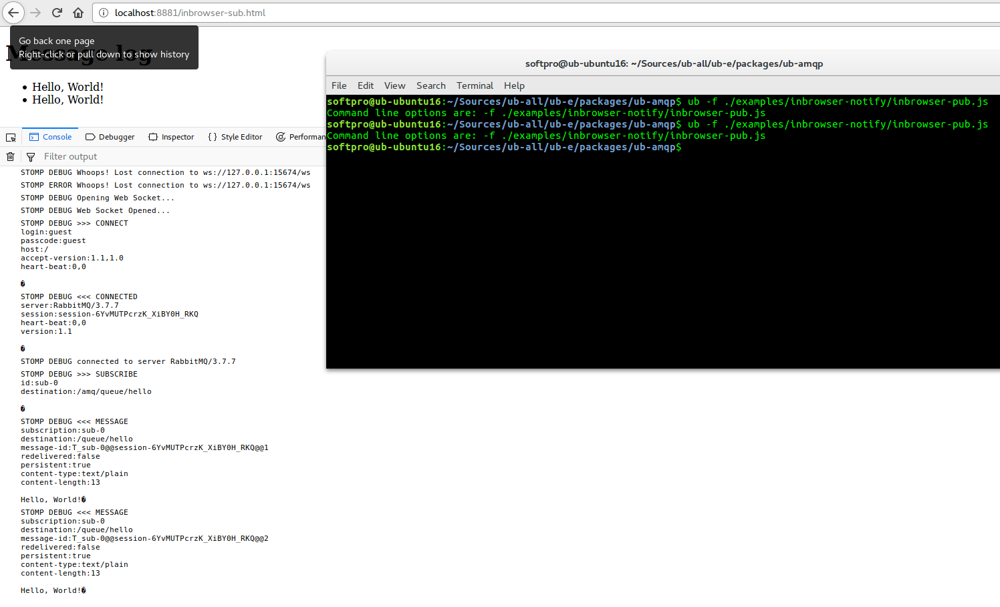

# @unitybase/amqp

A RabbitMQ client for UnityBase
As UnityBase has synchronous nature, it is hard to even impossible to use existing RebbitMQ clients for node.js like amqplib. @unitybase/amqp client mimics amqplib interface as close as possible keeping different programming model in mind. Internally UB-AMQP uses rabbitmq-c library to connect to RabbitMQ.
Besides the library, this package provides a server-side implementation of the server-to-client notifier - it is provided as UBServerNofifier class. Client part of the notifier is provided as @unitybase/amqp-notify package

## Project Status

As for the moment (July 2018) @unitybase/amqp is ready for experimental use
Please note that not all tests are currently passing, but these tests are for extended use cases.
The library interface is rather stable in terms of the list of methods and number of arguments passed. But default values for parameters and internal implementation could vary from build to build.
SSL is also is not implemented currently

## Examples

There are two examples of how to use this library are bundled
Please consider also to look into tests to see how the library can be used

### "Hello, World" example

This example shows how to connect, declare a queue, send and receive simple message using @unitybase/amqp library
Just try to start hello-sub.js in one terminal window first, then run hello-pub.js in another terminal window. Upon successful run of hello-pub.js script, you should see the "Hello, World!" message displayed in the window where hello-sub.js script is running.

### In-browser notification example

One of the reasons to use RabbitMQ is to establish server-to-client communication with guaranteed delivery. It is possible with RabbitMQ [web-stomp plugin](https://www.rabbitmq.com/web-stomp.html) and stomp client library (file stomp.js is bundled). This uses WebSockets as a delivery channel under the hood.

