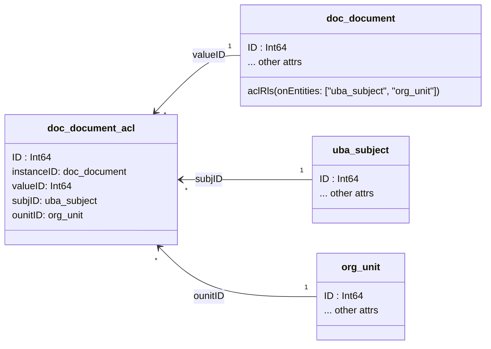

[[toc]]

# Entities (Сущности)

## Общая информация
**Сущность (Entity)** - базовая единица доступа к данным платформы UnityBase. Сущность определяет как способ
хранения данных, так и поведение(методы). Метаданные сущности могут быть использованы клиентскими приложениями для
построения пользовательского интерфейса.  

В клиент-серверной архитектуре ближайшая аналогия сущности - view в базе данных с триггерами на вставку/обновление/удаление записей.
В OOP - класс, реализующий ORM.
 
С точки зрения разработчика сущность - это:
 - файл в формате [JSON] с расширением `.meta` (метафайл), описывающий сущность и её атрибуты 
 - опционально, файл с таким же именем, но расширением `.js`, описывающий дополнительно поведение (методы) сущности на языке JavaScript  

Используя метафайл, UnityBase может:  
  - сгенерировать скрипт на создание таблицы в целевой БД для хранениея данных сущности (если таблица уже есть - скрипт на модификацию)
  - сгеренировать инструкции SQL для выборки/вставки/удаления/добавления данных
  - сгенерировать базовый пользовательский интерфейс справочника (грида) и формы редактирования записи
  - сгенерировать документацию в формате HTML
  - отобразить сущность в графическом виде на [ER diagram]
   
Пример метафайла __film_film.meta__: 

```json
{
    "caption" : "Кинофильм",
    "description" : "Конифильмы",
    "documentation": "Хранит все зарегистрированные кинофильмы",
    "descriptionAttribute" : "title",	
    "attributes" : {
        "IMDB": {
            "dataType": "String",
            "size": 12,
            "caption": "IMDB",
            "description" : "Идентификатор IMDB",
            "documentation": "Internet Movie Database (IMDb) идентификатор может быть использован для получения дополнительной информации о фильме через API www.omdbapi.com"
            "allowNull" : false,
            "isUnique": true    
        },
        "title": {
            "dataType" : "String",
            "size" : 100,
            "caption" : "Название",
            "description" : "Название кинофильма",
            "allowNull" : false
        }
    },
    "mixins" : {
        "mStorage" : {
            "simpleAudit": true,
            "safeDelete": true 
        }
    }
}
```

В данном метафайле мы описали сущность `кинофильм` с кодом `film_film`, у которой есть два атрибута: "Идентификатор IMDB" и "Название".   

Полная спецификация метафайла описывается следующей [JSON schema]:

 - [JSON схема (просмотр)](/docson/index.html#https://unitybase.info/models/UB/schemas/entity.schema.json) 
 - [JSON схема (исходник)](/models/UB/schemas/entity.schema.json)    

## Mixins (Миксины)
Сами по себе сущности не обладают поведением, оно описывается **методами** сущности. 
UnityBase содержит ряд готовых методов, решающих наиболее часто встречающиеся задачи. Реализация методов находится в **Миксинах**.
Разработчик может добавить свои методы к сущности либо перекрыть методы, добавленные миксинами.
     
В примере выше для сущности `film_film` мы подключили миксин `mStorage`. Собственно он добавил для нашей сущности
методы для [CRUID операций](https://en.wikipedia.org/wiki/Create,_read,_update_and_delete).

### mStorage - Implements CRUID operations with entities (ORM)
Добавляет методы:
  - addNew
  - select 
  - insert
  - update 
  - delete

Implements "Optimistic locking" and "Soft deletion" - check out [mStorage mixin guide](tutorial-mixin_mstorage.html) for additional reading.      
    
### audit - Аудит уровня записи
Обеспечивает запись всех низкоуровневых операций `insert`/`update`/`delete` в сущность аудита **ubs_audit**. 
Для операций `update` записываются как значения ДО обновления, так и новые. По умолчанию включен для всех сущностей системы.
  

### rls - Row Level Security (Безопасность уровня записей)
RLS is a security feature which allows developers to give access to a sub-set of data in their entity to others.
Traditional permission systems don't distinguish between individual rows in a table, so access is all-or-nothing. 
Grant to `select` method on a entity will allow a user to access all rows of that entity. 

RLS _supplements_ these with an additional layer of access controls on a per-row basis, so requirements such as 
"a manager can only view sensitive employee information for those employees who report to them" can be specified and enforced by the ORM.

Check out [Row Level Security Mixin](tutorial-mixin_rls.html) for additional reading.

### aclRls - Access Control List Row Level Security
[Access Control List](https://en.wikipedia.org/wiki/Access_control_list) Row Level Security is a commonly used
implementation of Row Level Security conception, so we implement it as a mixin and add a client-side features for edit ACL. 

Unlike `acl` mixin, what allows set "static" rule for selecting rows, `aclRls` mixin allows end user or program
to specify grants for each row.

Consider we have `doc_document` entity and wants to allow supervisor to specify specific grants for every document.
And we need to give grant either to user, or to role or to group or to organization unit.

For this we add `aclRls` mixin into mixins section of `doc_document` metadata and specify `onEntities` to be
  - `uba_dubject`: for users, groups and roles, since this entity is a unity for all administration subjects
  - `org_unit`: for organization units

`doc_document.meta` example:
```json5
{
  "caption": "Documents",
  "attributes": {
    // document attributes ...
  },
  "mixins": {
    "mStorage": {
    },
    "aclRls": {
      "onEntities": [
        "org_unit",
        "uba_subject"
      ]
    }
  }
}
```

After execution of `ubcli migrate` command `doc_document_acl` table will be added into database.
Entity `doc_document_acl` will be automatically generated by (inside `@unitybase/ub` model metadata hook).
Here is a result:



After this for each  `doc_document.select` call `aclRls mixin` will add
```sql
  and exists (select 1 from doc_document_acl where instanceID = doc_couemtn.ID and valueID in :admSubjIDs)
```
condition.

Value of `admSubjIDs` parameters - is result of function, what specified in `aclRls.subjectIDsFn` parameter.
In out example we do not add `subjectIDsFn` parameter, so default `RLS.getDefaultAclRlsSubjects` will be used.

> default `RLS.getDefaultAclRlsSubjects` is applicable only in case onEntities contains only uba_subject or/and org_unit

Filtering condition can be changed from `Exist` to `In` by specifying `aclRls.selectionRule: "In"`.
Form our experience `exists` is faster in most case.

It is possible to disable adding an `aclRls` filter by specifying function name in `aclRls.skipIfFn`.
If function returns `true` - filtering condition is not added.
By default, skipIfFn is set to `RLS.isSuperUserOrInAdminGroup`, which skip aclRls in case current user is `admin` or `root`
or `Admin` group member.

Parameters `skipIfFn`, `subjectIDsFn` and `selectionRule` can be specified for every entity or defined globally in the
application `ubConfig.json`:
```json5
{
  "application": {
    "domain": {
      //...
    },
    "mixinsDefaults": {
      "aclRls": {
        "skipIfFn": "RLS.isSuperUserOrInAdminGroup",
        "subjectIDsFn": "RLS.getDefaultAclRlsSubjects",
        "selectionRule": "Exists"
      }
    }
  }
}
```

For individual call aclRls can be disabled by adding `misc({__skipAclRls: true})` into repository
```javascript
UB.Repository('doc_document').attrs(['ID'])
  .misc({skipAclRls: true}).limit(1).selectSingle()
```
> ! `skipAclRls` works ONLY for server repository

For other `aclRls` options see description in [entity schema](/docson/index.html#https://unitybase.info/models/UB/schemas/entity.schema.json)

> Before UB@5.22.10 instead of `skipIfFn` and `subjectIDsFn` `exprMethod` method is used. This method is OBSOLETE


### als - Attribute Level Security
Методы миксина:
 - `getallroles` - Получить список всех ролей, включая динамические роли сущности
 - `getallstates` - Получить список всех состояний, включая динамические состояния сущности
 - `beforeselect` - Подготовка служебных данных для составителя запросов, включая текущее состояние и текущие роли записи сущности 
 - `afterselect` - Формирование ALS-информации для клиента
 - `beforeupdate` - Подготовка служебных данных для составителя запросов, включая текущее состояние и текущие роли записи сущности


Свойства миксина:
 - `stateAttrName` - имя атрибута, который содержит в себе информацию о текущем состоянии записи сущности.  
    Если значение этого свойства задано, то миксин выполнит запрос в БД, чтобы получить его, 
    иначе миксин вызовет у сущности метод `getRecordCurrState`.   
    Метод `getRecordCurrState` во время своего выполнения должен записать значение текущего состояния в свойство `_currRecordState`(строковый тип). 
       
    Данное свойство используется в методах `beforeselect` и `beforeupdate`. 
 
    Пример реализации `getRecordCurrState`:  
    ```javascript
    /**
     * Сформировать и вернуть текущее состояние для записи сущности
     * @param {ubMethodParams} runparams
     * @return {Boolean}
     */
    me.getRecordCurrState = function(runparams) {
        var
            /** @type {TubDataStore} */
            iDoc,
            rp = runparams.mParams;
    
        iDoc = UB.Repository('doc_incdoc').attrs(['mi_wfState'])
            .where('[ID]', '=', rp.ID)
            .select();
        if (!iDoc.eof) {
            rp._currRecordState = iDoc.get('mi_wfState');
        }else{
            rp._currRecordState = '';
        }
        return true;
    };
    ```
 - `stateEnumGroup` - название группы нумерованного списка из сущности `ubm_enum`.  
    Если значение этого свойства задано, то миксин сначала выполнит запрос к сущности `ubm_enum` и из полученных данных заполнит два массива состояний: массив значений и массив описаний.  
    Если значение не задано, то этот шаг пропускается.  
    После этого миксин вызовет у текущей сущности метод `addAllDynStates`, от которой также ждет массив значений и массив описаний.  
    Эти два массива во время выполнения `addAllDynStates` должны быть записаны в свойства `_dynStateValues` и `_dynStateNames` соответственно. 
    
    Данное свойство используется в методе `getallstates`.
    
    Пример реализации `addAllDynStates`:  
    ```javascript
    /**
     * Сформировать и вернуть массив всех динамических состояний сущности
     * @param {ubMethodParams} runparams
     * @return {Boolean}
     */
    me.addAllDynStates= function(runparams) {
        var rp = runparams.mParams,
            arrValues = [],
            arrNames = [];
    
        arrValues.push('new');
        arrNames.push('Новая запись');
        arrValues.push('closed');
        arrNames.push('Закрытая запись');
    
        rp._dynStateValues = arrValues;
        rp._dynStateNames = arrNames;
        return true;
    };
    ```
    
    Ещё один пример реализации `addAllDynStates`:  
    ```javascript
    /**
     * Сформировать и вернуть массив всех динамических ролей сущности
     * @param {ubMethodParams} runparams
     * @return {Boolean}
     */
    me.addAllDynRoles = function(runparams) {
        var rp = runparams.mParams,
            arrValues = [],
            arrNames = [];
    
        arrValues.push('recordOwner');
        arrNames.push('Создатель записи');
        arrValues.push('worldOwner');
        arrNames.push('Создатель мира');
    
        rp._dynRoleValues = arrValues;
        rp._dynRoleNames = arrNames;
        return true;
    };
    ```
 - `optimistic` - булевое значение позволяющее узнать является ли администрирование оптимистичным(`true`) или пессимистичным(`false`).  
   Значение этого свойства используется только в одном случае - когда на сущности нет **НИ ОДНОГО** администрирования ALS. 
   В таком случае при оптимистичном администрировании все атрибуты будут иметь **ВСЕ** права, при пессимистичном администрировании у атрибутов **НЕТ** прав.
    
#### Условия для администрирования атрибутов с помощью миксина ALS
Для администрирования атрибутов сущности с помощью миксина `ALS` необходимо выполнение следующих условий:
 - Миксин должен быть прописан в meta-файле сущности:
    ```json
    ...
    "mStorage": {
        "simpleAudit": true,
        "safeDelete": true
    },
    "als": {
        "stateAttrName": "mi_wfState",
        "stateEnumGroup": "",
        "optimistic": true
    },
    ...
    ```
 - В `Post-параметрах` от клиента на верхнем уровне должен быть параметр  с именем `ID`  
    (Это связанно с тем что на текущий момент миксин администрирует пока только **ОДНУ** запись сущности)
 - В `Post-параметрах` от клиента на верхнем уровне должен быть параметр `alsNeed: true`

#### Алгоритм работы миксина ALS
Миксин ALS работает следующим образом:
 1. Если клиентом был вызван метод `select`, то в `Post-параметрах` происходит поиск `ID` и `alsNeed: true`.  
    Если клиентом был вызван метод `update`, то в `Post-параметрах` происходит поиск `ID` и `execParams`.  
    Если все нужные параметры найдены, то переход к п.2. Иначе миксин не делает никаких действий. 
 2. Если у миксина задано свойство `stateAttrName`, то происходит получение этого значения. 
 3. Происходит получение роли текущей записи сущности (с идентификатором `ID`).  
    (Это роли пользовательской сессии, под которой выполняется миксин плюс динамические роли сущности из метода `getRecordCurrDynRoles`) 
    
    Пример реализации метода `getRecordCurrDynRoles`:  
    ```javascript
    /**
     * Сформировать и вернуть массив динамических ролей для записи сущности
     * @param {ubMethodParams} runparams
     * @return {Boolean}
     */
    me.getRecordCurrDynRoles = function(runparams) {
        var
            /** @type {TubDataStore} */
            iDoc,
            arrValues = [],
            rp = runparams.mParams;
    
        iDoc = UB.Repository('doc_incdoc').attrs(['mi_owner'])
            .where('[ID]', '=', rp.ID)
            .select();
    
        if (!iDoc.eof) {
            if (iDoc.get('mi_owner') === Session.userID){
                arrValues.push('recordOwner');
            }
        }
    
        arrValues.push('worldOwner');
        rp._currDynRoleValues = arrValues;
        return true;
    };
    ```
 4. Миксин формирует служебную информацию составителю запросов, 
    и при построении запроса для каждого атрибута определяет права для текущего состояния и текущих ролей. 
 5. Если клиентом был вызван метод `select`, то миксин в методе `afterselect` сформирует для клиента следующую структуру:  
    ```json
    ...
    "fieldList": ["ID", "outNumber", "outDate"],
    "resultAls": {
        "ID": "SUM",
        "outNumber": "UM",
        "outDate": "S"
    },
    ...
    ```
 6. Если клиентом был вызван метод `update` и у него нет прав на изменение данных, 
    то миксин не даст ему изменить атрибут. 

    Текст ошибки будет таким: **ALS: Update deny. Cannot update attribute "outDate" in entity "myWork" for state "NEW"**.

**Символьные значения прав**:  
 - Select - право пользователя видеть значение атрибута
     - **Символ:** S
     - **Значение:** 0b001
 - Update - право пользователя изменять значение атрибута
     - **Символ:** U
     - **Значение:** 0b010
 - Mandatory - является ли значение атрибута обязательным
     - **Символ:** M
     - **Значение:** 0b100

Значение можно комбинировать получая различные битовые маски доступа:    
    1 - можно выбирать  
    2 - можно апдейтить  
    4 - обязательное 
    3 - это можно выбирать и апдейтить  
    7 - выбирать апдейтить и обязательное  
    5 - обязательное и выбирать  
    и т.д.  

### dataHistory - Историчность записей
  
### unity
   
### tree - древовидные структуры с построением хранимого пути   

### fts - полнотекстовое индексирование данных сущности

### softLock - Пессимистические блокировки (Pessimistic locks)

See detailed [pessimistic locking guide](tutorial-mixins_softlock.html)

### clobTruncate - Обрезает большие текстовые поля 
   
[JSON]:http://www.json.org/
[ER diagram]:https://en.wikipedia.org/wiki/Entity%E2%80%93relationship_model
[JSON schema]:http://json-schema.org/ 