[[toc]]

# Application lifecycle and data migrations
Migrations are a convenient way to alter your database schema and data over time in a consistent and easy way. 

UnityBase already contains a powerful tool what helps to:
  - migrate a database structure - `ubcli generateDDL`
  - migrate a data `ub-migrate` 

Both of them check a current state of tables/data and tries to bring them to the reference version.
For database tables reference version is a `*.meta` files, for data - `_data/*.yml` files.

But sometimes these tools can't do his job automatically. For example, we decide to rename an entity.
In this case DDL generator creates a new table for a new entity. The old one is remains untouched,
and this is not the thing we expect. So we need to provide a pre-generate DDL hook and rename our table manually 
using `alter table .. rename to ..` or similar.

Another example is changes in data not covered by `ub-migrate`. Consider we have a Firm entity with 2 attributes (code, name)
and need to update all Firm names and add a code part to the beginning of name (to simplify selection).
In this case good solution is to write a custom JS what solves this task and run it during version upgrade.  

## Overview
UnityBase migration tool is `ubcli migrate`. The flow: 

```mermaid
graph TD
    start[ubcli migrate] --> dbLoad(Load dbVersions - migration state from the ub_version and ub_migration DB tables)
    dbLoad --> filesLoad(For each model read migration files list from the _migrate folder)
    filesLoad --> filterOutdated(Exclude migration files for model versions prior to dbVersions)
    filterOutdated --> filterApplied("Exclude already applied files (present in ub_migration table) and verify files SHA")
    filterApplied --> noddl{-noddl?}
    noddl --> |Yes| skipMigrateData{-nodata?}
    noddl --> |No| jsHookBefore("For each model call beforeGenerateDDL from _migrate/_hooks.js")
    jsHookBefore --> fileHookBefore("For each model execute _migrate/*_beforeDDL_*.[sql|js] files")  
    fileHookBefore --> connectToServer("Create SyncConnection to server")
    connectToServer --> jsHookBeforeC("For each model call beforeGenerateDDLc from _migrate/_hooks.js")
    jsHookBeforeC --> fileHookBeforeC("For each model execute _migrate/*_beforeDDLc_*.[sql|js] files")  
    fileHookBeforeC --> generateDDL("Call `ubcli generateDDL -autorun`")
    generateDDL --> jsHookAfter("For each model call afterGenerateDDL from _migrate/_hooks.js")
    jsHookAfter --> fileHookAfter("For each model execute _migrate/*_afterDDL_*.[sql|js] files")  
    fileHookAfter --> skipMigrateData
    skipMigrateData --> |No| checkUbMigrate{{"Is @unitybase/ub-migrate installed?"}}
    checkUbMigrate --> |Yes| callUbMigrate("Sync entites data with yaml's from the models _data folders")
    checkUbMigrate --> |No| applyfilterFilesHook
    callUbMigrate --> applyfilterFilesHook
    skipMigrateData --> |Yes| applyfilterFilesHook("For each model call filterFiles from _migrate/_hooks.js")
    applyfilterFilesHook --> executeUsualFiles("For each model execute _migrate/*.[js|sql] files")
    executeUsualFiles --> jsHookFinalyze("For each model call _migrate/_hooks.js finalize")  
    
    click checkUbMigrate "https://git-pub.intecracy.com/unitybase/ub-migrate/-/blob/master/README.md" "Click for @unitybase/ub-migrate documentation"
    click callUbMigrate "https://git-pub.intecracy.com/unitybase/ub-migrate/-/blob/master/README.md" "Click for @unitybase/ub-migrate documentation"
```


## Creating a Migration
### Naming conventions
All migrations are stored in `_migrate` sub-folder in the model directories (for historical reasons _migrations name is busy) 

Individual migration can be a folder or a file. Each migration MUST starts from model version in format `XXXYYYZZZ` where:
  - XXX-major
  - YYY-minor
  - ZZZ-patch
All parts are padded by 0 to be a three letter.

For better human readability version can be written in `.` or `_` notation - a 3 group of digits (3 digit max)
separated by either `.` or `_`. Such versions are transformed to 9-digits notation just after reading a file names and 
all other operations (sorting, comparing, inserting in ub_migration table) are done with normalized file names.

In case migration is a folder all files inside a folder SHOULD begin from 3 digits - and order in which it will be applied.
Example:

```
/myModel
  /_migrate
    001001001-initial.sql     # a single file migration to myModel@1.1.1
    1.01.02-initial.sql       # a single file migration to myModel@1.1.2 in dotted notation
    /1.01.02                  # a multifile migration to myModel@1.1.2
      010-impl-RST-1222_SPGetBallance.sql    # files inside folder execuded in lexical order
      020-fixCaptions.js
      030-massiveCaptionUpdate.sql  
```

> TIP: files and folders what starts from `_` are ignored

### Migrations under development
During development, it is unknown when our branch will be merged into main branch and in which version
our migrations will be released. To solve this problem (and prevent possible merge conflicts) it's recommended to
begin migrations names with `unreleased`:

```
/myModel
  /_migrate
    001001001-initial.sql       
    /001001002                  
      010-alter_my_table.sql
      ...  
    /unreleased                 # unreleased multifile migration (folder)
      010-fix-UBJS-1223.sql    
    unreleased-fixUBA-1255.js   # unreleased single file migration  
```

For packages what published in the registry a `@unitybase/update-changelog` (TODO) lifecycle hook will rename such migrations 
to a version what actually publishing. Developer SHOULD add such hook call to "scripts.version" section of package.json:
```
"scripts": {
  "version": "update-changelog && git add CHANGELOG.md"  !! TODO - git add or git mv
}
```

For models that are not published in the registry (usually sub-folders of `models` folder) a version build CI script
SHOULD rename an unreleased migration. 

> TIP: `ub-pack` lifecycle script will check version don't contain an unreleased migration (TODO)

### SQL scripts features
#### Specifying a DB connection
In complex application one model can store its data in the several DB connections (not recommended).

By default, *.sql files are executed using default DB connection (`isDefault: true` in connections section of ubConfig).
To execute a script in specific connection file (or folder) name should contain connection name wrapped in #.

Actually `/#(.*?)[\-.#/]/` regular expression is used, so the ending char can be one of `-.#` or migration folder name ends with `#conn`.
All names below are specify a SECOND connection:
  - /unreleased#SECOND# 
  - /unreleased#SECOND
  -  010#SECOND#fix-UBJS-1223.sql (use #SECOND#)
  -  010#SECOND-fix-UBJS-1223.sql (use #SECOND-)
  -  010#SECOND.fix-UBJS-1223.sql (use #SECOND.)

Example:
```
 /myModel
   /_migrate
     /unreleased                 
       010#rrpUb#fix-UBJS-1223.sql          # if connection with name `rrpUb` exists this script will be executed there
       020-fix-VP-3_addVP_PP_table.sql      # and this - in default connection
     /unreleased#rst                        # all SQL files from this folred will be executed in `rst` connection
       010-some.sql                                
 ``` 

#### Migrations for non-table Database objects (views, procedures etc.)
UnityBase based projects trends to be database agnostic and usually do not use RDBMS specific features like views, procedures etc.,
but sometimes, for example when mapping to the existed database, using of views/procedures simplify a development.

In this case the referential database objects can be stored somewhere in the model and when changed can be sym-linked to the
`_migrate` folder with a proper name. 

Consider we need maintains a view `v_coursesFromBankDB` and place it definition in the `myModel/_database/v_coursesFromBankDB.sql`
```
CREATE OR REPLACE VIEW v_coursesFromBankDB AS
SELECT .......
``` 

```
/myModel
  /_database
    v_coursesFromBankDB.sql
  /_migrate
    /001001000
      010-#connName#v_coursesFromBankDB.sql    # a symblik link to ../../_database/coursesFromBankDB.sql
```    

When view `myModel/_database/v_coursesFromBankDB.sql` is changed in version 2.0 of the model we can add it into new migration:
```
/myModel
  /_database
    v_coursesFromBankDB.sql
  /_migrate
    /001001000
      010-#connName#v_coursesFromBankDB.sql     # a symblik link to `../../_database/coursesFromBankDB.sql`
    002001000-#connName#v_coursesFromBankDB.sql # a symblik link to the same file as in firs migration `../_database/coursesFromBankDB.sql`
```    
> as noted above migration can be a file - as we did for `002001000#connName#-v_coursesFromBankDB.sql` 

> **IMPORTANT** The reference path of the source file should be relative to the repository

```shell script
# Not good for Git repositories
ln -s /Users/pavel/dev/app/myModel/_database/v_coursesFromBankDB.sql ./_migrate/001001000/010-#connName#-v_coursesFromBankDB.sql

# Good for Git repositories
cd ./_migrate/001001000 && ln -s ../../_database/coursesFromBankDB.sql 010-#connName#-v_coursesFromBankDB.sql
git add 010-#connName#-v_coursesFromBankDB.sql
```

#### Conditional SQL
Under the hood SQL scripts are executed using `ubcli execSql` command, so can be a [lodash template](https://lodash.com/docs/4.17.15#template).  
Example:
 
```
 <% if (conn.dialect.startsWith('MSSQL')) { %>
  SQL server specific statement
  <% } else { %>
  non SQL server statement
  <% } %>
  --
  one more statement for any DBMS;
  --
```

`conn` is a connection config (as it specified in ubConfig `application.connections` section) for connection script is executed in.

`--@optimistic` feature of execSql also works here
 
 > the `optimistic` mode is dangerous - use it if it absolutely required
   
### JS file requirements

Each *.js file MUST export a function. This function will be called by migrate with 4 parameters:
```javascript
/**
 * Migrate the CDN model to 2.13.15 (update cdn_person captions)
 * @param {SyncConnection} conn
 * @param {Object<string, DBConnection>} dbConnections
 * @param {Object} dbVersions
 * @param {{hooks: Array<{model: string, hook: Object<string, function>}>, files: Array<{model: string, name: string, fullPath: string, sha: string}>}} migrations
 */
module.exports = function giveItAGoodNameWhichExplainWhatFunctionDoes ({ conn, dbConnections, dbVersions, migrations }) {
  // do something here
}
```
 
 
## Applying a Migrations

For development purpose and under Windows:  
```
cd /path/to/app/folder
ubcli migrate -u root
```

> under unix `ubcli` is called by shell script /usr/bin/ubcli, so npx can be omitted. Under Windows use `npx ubcli ....`

On the Linux-based production environment (see [Manage production environment](https://unitybase.info/api/server-v5/tutorial-production_env.html))
```
sudo -u unitybase ub-app-upgrade --app app_name 
```

`migrate` execute only scripts what do not exist in the `ub_migration` table.
 
Before any operations `migrate` verifies SHA sums (+modelName) is matched for intersection of all files in `ub_migration` table
and all `_migrate` folder files (excluding files what starts from `_`). If any file checksum differ then migration
**is fails** (neither generateDDL nor ub-migrate nor any `_mirgate` script are not executed).

On the adminUI interface two shortcuts are added `Administrator->Migrations->Applied files` and `Administrator->Migrations->Models versions`.
Use it to see all applied migration files and models versions on the moment of last success migration. 

## Migration hooks

### Using naming convention
Migration file or folder name can contain a `_beforeDDL_`, `_beforeDDLc_` or `_afterDDL_` substring. Such files are applied before/after DDL generation. 

 - **_beforeDDL_** js hook is called with `conn === null` because on this stage HTTP connection to the server is impossible.
 - **_beforeDDLc_** js hook is called after beforeDDL hooks but before generateDDL and HTTP connection is available here (conn !== null)
 
### Using per-model _hooks.js
A `/_migrate/_hooks.js` file for each model can exports migrations hook. 
The possible hooks are:
  - `beforeGenerateDDL`     # a good place to alter database objects (server **is not** started here)
  - `beforeGenerateDDLc`    # a good place to modify a data using fields what can be dropped/altered by generateDDL (server is started, SyncConnection is available)  
    - here generateDDL is executed
  - `afterGenerateDDL`      # a good place for massive update columns
    -  here ub-migrate is executed
  - `filterFiles`           # remove some scripts from execution (called in reverse order of models, should mutate a `migtarions.files` array)
    - here sql and js form `_migrate` folder are executed
  - `finalize`              # executed after any migration

See overview diagram in the beginning ot the article.

A hook signature is:
```javascript
/**
 * before generate DDL hook example
 * @param {SyncConnection} conn
 * @param {Object<string, DBConnection>} dbConnections
 * @param {Object} dbVersions
 * @param {{hooks: Array<{model: string, hook: Object<string, function>}>, files: Array<{model: string, name: string, fullPath: string, sha: string}>}} migrations
 */
function beforeGenerateDDL ({ conn, dbConnections, dbVersions, migrations }) {
  // do something here
}
```

> beforeGenerateDDL hook is called with conn: null because on this stage HTTP connection to the server is impossible
> 
> beforeGenerateDDLc hook is called after beforeGenerateDDL and befor actual generateDDL and HTTP connection is available here
  
   