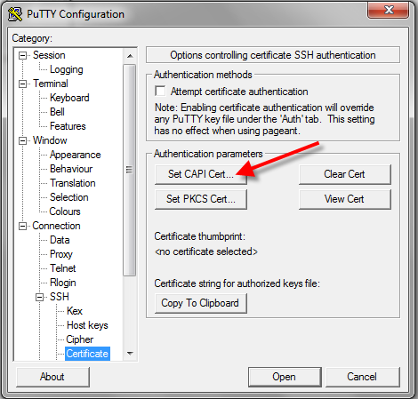

To configure ssh authentication with public keys follow next steps.

1. On Linux server make sure **only owner** can write to home folder, `.ssh` folder and `authorized_keys` can be read and write **only by owner**.
Or you can execute this commands:
```
chmod g-w /home/your_user
chmod 700 /home/your_user/.ssh
chmod 600 /home/your_user/.ssh/authorized_keys
```

2. Install [Putty-CAC](https://github.com/NoMoreFood/putty-cac/releases) on Windows client.
This modified Putty version was made to support smart cards & certificates

2. At the PuTTY Configuration window side-bar, go to Connection > SSH > Certificate. Click Set CAPI Cert….
    

3. At the Windows Security window, select your certificate.

4. Back at the PuTTY Configuration window, you’ll see the certificate thumbprint. Click the Copy to Clipboard button.

5. In `.ssh` folder execute:
    ```
    echo [paste key from clipboard] >> authorized_keys
    ```

   The key will look like this:
   `ssh-rsa AAAAB3NzaC1yc2EAAAADAQABAAABAQCyPn2dShOF..  . CAPI:05bf4653b3098a87b67816d81049f489d5b5ffb4`

   This command **append** your key to authorized_keys, and now you can login with certificate.