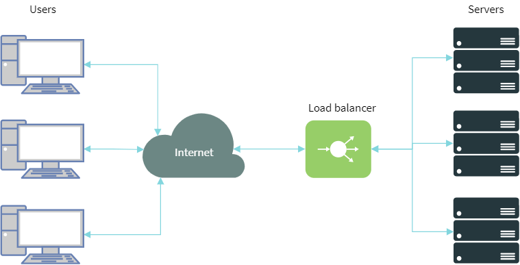

[[toc]]

# Using Nginx as a reverse proxy and load balance


Using some kind of [reverse proxy](https://en.wikipedia.org/wiki/Reverse_proxy) 
in combination with UnityBase application server is MUST HAVE for Socket type UB server (Linux, Windows) and optional
but strongly recommended for HTTPSys base http server under Windows.
    
Reverse proxy can be used to:
 - HTTP protocol verification and prevention of protocol level attacks
 - TLS termination
 - handling static files (with gziping, streaming, partial downloads, cache)
 - load balancing (with sticky sessions `ip_hash` for example)
 - request body size limitation
 - geo-ip filtering
 - rate limit (limit the amount of HTTP requests a user can make in a given period of time) 
 - etc.
 
Below we describe how to configure nginx as a reverse proxy for ub 

## Configuring UnityBase application

In the application config (ubConfig.json) add `externalURL` and `reverseProxy` keys:    

```json
{
  "httpServer": {
    "externalURL": "https://myapp.mydomain.com",
    "reverseProxy": {"kind": "nginx"}
  }
,
}
```

`externalURL` is address of your application for the end-user (address they type in browser)
 
## Serving static assets by nginx
UnityBase itself can server a static assets - files placed in
 - models public folders (available using `/models` endpoint)
 - application node_modules folder (available using `/clientRequire` endpoint on server and calls to `require()` and `System.import()` on client)   

This is useful on development stage, but on production stage we highly recommend to allow nginx to server a static assets. 

Serving static by nginx improves:
 - user experience during application loads: while UB servers a API requests nginx can serve static 
 - decrease a UB logs size
 - decrease a overall load for UB server (approximately 0.5ms for each static file)

### Prepare application for serving static by nginx

  - define `httpServer.inetPub` parameter in config. This is a folder where static files will be stored. Usually = `./itetpub`
  - run a command `npx ubcli linkStatic`. This command creates a `.linkStatic.sh` script for sym-linking a static assets into `inetPub` folder
  - execute a `.linkStatic.sh`     

Step 2) and 3) must be performed every time application is updated. Recommended steps for update app

```bash
cd /your/app/folder
# checkout a new package-lock.json
npm ci
npm ddp
npx ubcli linkStatic -u .. -p ... - cfg ...
chmod +x ./.linkStatic.sh
./.linkStatic.sh
``` 

Last command in script will set a modification time for all files downloaded from package registry (files with modify date === 1986-01-01)
to the current time. This allow nginx to generate a correct ETag for such files.
       
### How to prevent server-side logic to be exposed for client
Some of modules placed into `node_modules` folder can contains a server-side logic what should be hidden from clients.
  
First let's explain what modules are exposed:
   - modules without `config.ubmodel` section and modules with `config.ubmodel.isPublic: true` inside package.json
     are exposed as is (sym-linked into ${httpServer.inetPub}/clientRequire)
   - for modules with `config.ubmodel && !config.ubmodel.isPublic` only `public` folder content and package.json itself
     is sym-linked into ${httpServer.inetPub}/clientRequire. All other model folders are hidden from client

So, **to hide all package files from client add a "config" : {"ubmodel": {} } section into package.json**
    
## Configuring nginx
`ubcli` tool have a command `generateNginxCfg` for creating a include for nginx based on application configuration.

cd to your application folder and type  

```bash
npx ubcli generateNginxCfg
```  

This command generate file `ub-proxy.conf` ready to be included into main nginx configuration.

To see additional parameters what can be passed to `generateNginxCfg` type
```bash
npx ubcli generateNginxCfg --help
```  

In case external url is use HTTPS protocol, you need to add `-sslkey path/to/key -sslcert path/to/cert`. 
Also we recommend to add `-r` for adding redirection from http to https:

```bash
npx ubcli -r generateNginxCfg -sslkey /usr/www/.ssh/web_key.key -sslcert /usr/www/.ssh/web_ker_cert.pem
```

If you expect user need to store a big documents add `-maxDocBody XXXm` where XXX ia a maximum document size (in Mb) for upload.      

Generated config is well documented - see comments inside for explanation of what we did there. 

`ub-proxy.conf` we generate should be included into `nginx.conf`:  

For Windows add this line to end of http section inside `nginx.conf`:
```
include path/to/ub-proxy.conf;
```
and restart nginx.

For unix symlink file into /etc/nginx/sites-enabled
```bash
sudo ln -s path/to/ub-proxy.conf /etc/nginx/sites-available/default_server.cfg 
sudo ln -s /etc/nginx/sites-available/default_server.cfg /etc/nginx/sites-enabled 
sudo nginx -s reload 
```

## Load balancing

Generated config is ready to be extended for load balancing.

Pass `-lb` option for adding load balancer specific settings to nginx config.
```bash
npx ubcli generateNginxCfg -lb
```

in the generated config adds additional servers inside `upstream` section 
