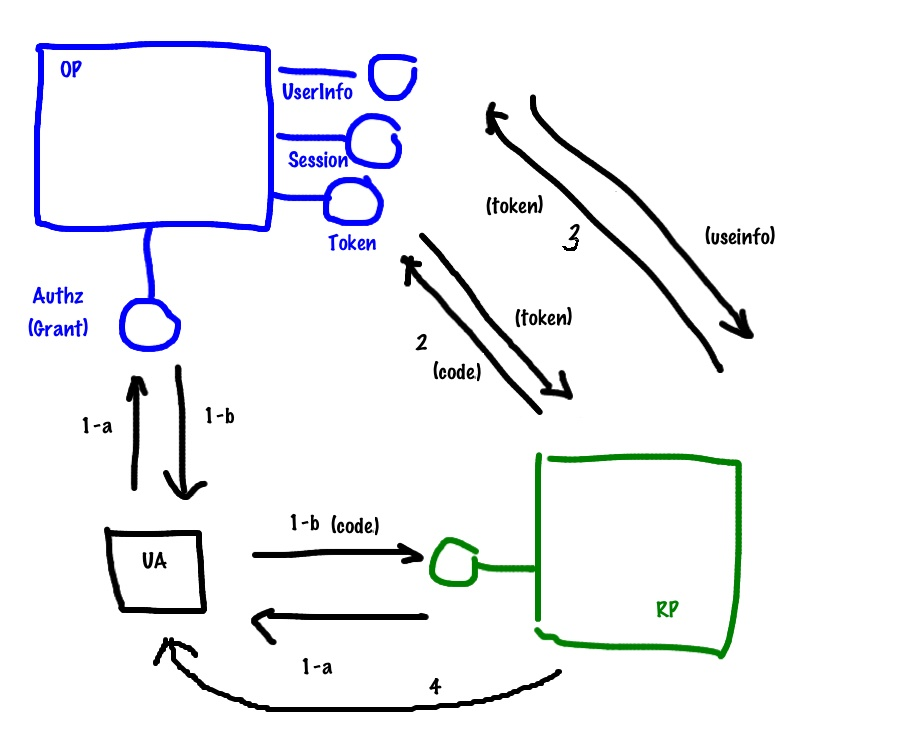

[[toc]]

# Автентифікація на сервері UB за допомогою OpenID Connect

У версії 1.11 додано механізм автентифікації з використанням третьої сторони
за протоколом [OpenID Connect] (https://en.wikipedia.org/wiki/OpenID_Connect).

У цій схемі автентифікація (перевірка імені користувача та пароля) проводиться
**провайдером OpenID Connect** (наприклад, Google), а подальша авторизація - з використанням
[протоколу авторизації UB](https://dev.softengi.com/confluence/display/UB/Authentication+in+1.8)

## Реєстрація на стороні провайдера OpenID Connect
Відповідно до документації вашого OpenID Connect провайдера необхідно зареєструвати додаток.
Для реєстрації в Google інструкція [за цим посиланням](https://developers.google.com/identity/protocols/OpenIDConnect)

При реєстрації необхідно повідомити провайдера адресу на яку з нього дозволено робити редірект (не для всіх провайдерів),
і отримати:

- url авторизації (**authUrl**)
- url отримання токена (**tokenUrl**)
- url отримання інформації про користувача (**userInfoUrl**)
- id нашої програми (**client_id**)
- secret нашої програми (**client_secret**)

## Налаштування сервера UB

### Зміни в конфігураційному файлі
Для використання AdminUI в секції authMethods додаємо значення "OpenIDConnect":
```json
...
"authMethods": [...,"OpenIDConnect"...],
...
```

Для клієнтів, які не використовують метаінформацію сервера для побудови вікна логіну, цей крок не обов'язковий.

### У моделі прикладної області
```javascript
const openID = require('@unitybase/openid-connect')
// Реєструємо точку доступу
const openIDConnectEndPoint = openID.registerEndpoint('<EndPoint name>')
```

**`<EndPoint name>`** - ім'я точки доступу. Для AdminUI **потрібно** використовувати ім'я "openIDConnect"

```javascript
// Реєструємо провайдер
openIDConnectEndPoint.registerProvider(<Provider name>,{
    authUrl: <authUrl>,
    tokenUrl: <tokenUrl>,
    userInfoUrl: <userInfoUrl>,
    client_id: <client_id>,
    client_secret: <client_secret>,
    userInfoHTTPMethod: <userInfoHTTPMethod>,
    scope: <scope>,
    nonce: <nonce>,
    response_type: <response_type>,
    getUserID: function(userInfo) {
        ...
        return id
        ...
        return null
        ...
    },
    onFinish: <onFinish>
})
````
Пояснення та приклад для авторизації за допомогою Google*:

- **`<Provider name>`** - ім'я провайдера. Буде відображатися у списках доступних провайдерів цієї точки доступу.
  *_Наприклад, 'Google'_*

- **`<authUrl>`** - url авторизації, отриманий від провайдера.
  *_Наприклад, 'https://accounts.google.com/o/oauth2/auth'_*

- **`<tokenUrl>`** - url отримання токена, отриманий від провайдера.
  *_Наприклад, 'https://accounts.google.com/o/oauth2/token'_*

- **`<userInfoUrl>`** - url отримання інформації про користувача, отриманий від провайдера.
  *_Наприклад, 'https://www.googleapis.com/oauth2/v1/userinfo'_*

- **`<client_id>`** - id нашої програми, отриманий від провайдера.
  *_Наприклад, '350085411136-lpj0qvr87ce0r0ae0a3imcm25joj2t2o.apps.googleusercontent.com'_* (для зареєстрованої мною тестової програми)

- **`<client_secret>`** - secret нашого додатка, отриманий від провайдера.
  *_Наприклад, 'dF4qmUxhHoBAj-E1R8YZUCqA'_* (для зареєстрованої мною тестової програми)

- **`<userInfoHTTPMethod>`** - HTTP метод відправки параметрів для отримання інформації про користувача.
  Залежить від постачальника. Якщо вказано не 'POST', то використовується 'GET' (за замовчуванням).
  *_Наприклад, Google вимагає, щоб параметри для отримання інформації про користувача передавалися саме 'GET'_*

- **`<scope>`** - до яких api провайдера запитуємо доступ (поділяємо за допомогою '+').
  Зазвичай достатньо 'openid', але деякі провайдери можуть вимагати більшого списку.
  Або нам для авторизації користувача треба отримати більше інформації.
  *_Наприклад, 'openid'_*

- **`<nonce>`** - nonce, що передається провайдеру.
  У модулі його значення поки що не перевіряється. Параметр модуля необов'язковий.
  Деякі провайдери вимагають цей паетраметр як обов'язковий.
  *_Наприклад, '1'_*

- **`<response_type>`** - типи відповіді провайдера (поділяємо за допомогою '+').
  Для модуля важливо щоб серед типів відповіді був code - саме його модуль використовує.
  Деякі постачальники послуг можуть вимагати додаткових типів відповідей.
  *_Наприклад, 'code'_*

- **`<onFinish>`** - метод клієнта, який ми викликаємо після перевірки на право доступу користувача.
  Значення, яке використовується AdminUI - *'(function (response) { opener.postMessage(response, "*")})'*

- **getUserID** - функція, на вхід якої передається відповідь сервера на запит інформації про користувача.
  Функція повинна перевірити, чи має користувач з такою інформацією доступ до системи,
  можливо, створити нового користувача, призначити йому права,
  і повернути його id із сутності _uba_user_.
  Якщо користувач не має права на доступ до програми, функція повинна повернути `null`.

**Приклад функції:**  
```javascript
getUserID: function (userInfo) {
    var inst = UB.Repository('uba_user').attrs(['ID'])
        .where('[name]', '=', userInfo.id).select();
    if (inst.eof)
        return null;
    else
        return inst.get('ID');
}
```
## Принцип роботи

Після додавання точки доступу на сервері [реєструється](index.html#!/api/TubApp-method-registerEndpoint) ендпойнт
з ім'ям **`<EndPoint name>`**.

GET запит **`/<EndPoint name>`** без параметрів поверне масив імен зареєстрованих провайдерів для даної точки доступу.



Далі рекомендується відкрити в новому вікні (**window.open**) адресу **`/<EndPoint name>/<Provider name>`**
Сервер переадресує це вікно на форму автентифікації **провайдера**, тобто на **authUrl** (1-a).

Користувач аутентифікується, після чого провайдер переправляє його на адресу **`/<EndPoint name>/<Provider name>?code=...scope=...`** (1-b).

Сервер UB звертається до провайдера, та виконує обмін **'code'** на **'acces_token'**(2),
за допомогою якого запитує інформацію про користувача у провайдера(3).
Отримана інформація про користувача передається функції **getUserID**, яка вказана при реєстрації провайдера на сервері UB.

Завдання ф-ії **getUserID** за отриманою від провайдера інформацією користувача повернути ідентифікатор користувача
із сутності _uba_user_, або `null` якщо польщувачу вхід заборонено. На даному етапі можливе автоматичне створення
користувача.

- Якщо ф-я повернула непусте значення, сервер створює сесію для користувача і повертає html-сторінку,
  яка викликає метод **`<onFinish>`** з параметрами успішної авторизації та закриває вікно введення логіну/паролю провайдера.
- Якщо ф-я повернула порожньо, то html-сторінка, що повертається, викликає метод **`<onFinish>`** з
  ознакою неуспішної аутентифікації
  `{success: false}`

Приклад параметрів при успішній автентифікації:
```json
{
  success: true,
  data: {
    logonname: "<user login>",
    result: "<session word>",
    uData: "{<uData>}"
  },
  secretWord: "<secretWord>"
}
```

На даному етапі, якщо клієнт завантажений не за протоколом HTTPS, деякі браузери можуть лаяти користувача.

Робочий приклад для провайдера Google та IdentityServer3 реалізовано у додатку `Autotest`
(see `Autotest/models/TST/appLevelMethod.js`)

## Використання в PortalUI

AdminUI реалізує механізм підтримки безлічі провайдерів та методів аутентифікації, динамічно відбудовуючи форму
логіна в залежності від параметрів програми. У портальних рішеннях все набагато простіше.
Допустимо нам відомо, що на серверній частині зареєстрований ендпоінт `openIDConnect` та провайдер `IdentityServer`.
Наш портал для програми autotest буде приблизно таким:


```html
<!doctype html>
<html>
    <head>
        <meta charset="utf-8"/>
        <title>&laquo;UB portal&raquo;</title>

        <script charset="utf-8" src="/autotest/compiled/ub-core.js"></script>
    </head>
    <body >
        <h1>User list</h1>
        <div id="UBData"></div>
        <script type="text/javascript">
            var conn = new UBConnection({
                host: window.location.origin,
                appName: 'autotest/',
                requestAuthParams: function(conn, isRepeat){
                    var deferred = Q.defer();
                    var url = window.location.origin + '/autotest/openIDConnect/IdentityServer';
                 
                    var loginWindowOpenID = window.open(url, 'login', 'toolbar=0,scrollbars=1,status=1,resizable=1,location=1,menuBar=0');
                     
                    function loginListener(event) {
                        if (event.source === loginWindowOpenID) {
                            window.removeEventListener("message", loginListener);
                            if (event.origin.indexOf(window.location.origin) === 0) {
                                var response = event.data;
                                if (response.success) {
                                    response.authSchema = 'OpenIDConnect';
                                    deferred.resolve(response);
                                } else {
                                    deferred.reject('authOpenIDConnectFail');
                                }
                            } else {
                                deferred.reject('authOpenIDConnectFail');
                            }
                        }
                    }
                    window.addEventListener("message", loginListener);
                     
                    return deferred.promise;
                }
            });
            conn.run({entity: 'uba_user', method: 'select', fieldList: ['ID', 'name']}).then(function(result){
                var htmlTpl = '<table cellspacing = "0" border ="1">'+
                              '<tr><td style = "text-align: center; padding: 2px;"><b>id</b></td>'+
                              '<td style = "text-align: center; padding: 2px;"><b>login</b></td></tr>'+
                              '<% _.forEach(resultData.data, function(user){%>'+
                              '<tr><td style = "padding: 2px;"><%- user[0] %></td>'+
                              '<td style = "padding: 2px;"><%- user[1] %></td></tr><%}); %>'+
                              '</table>';
                document.getElementById("UBData").innerHTML = _.template(htmlTpl)(result);
            });
        </script>
    </body>
</html>
```
Profit!